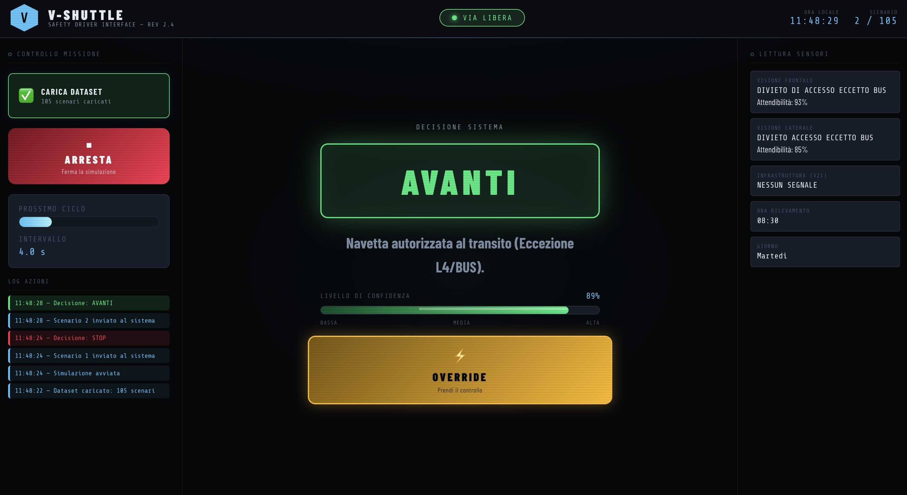
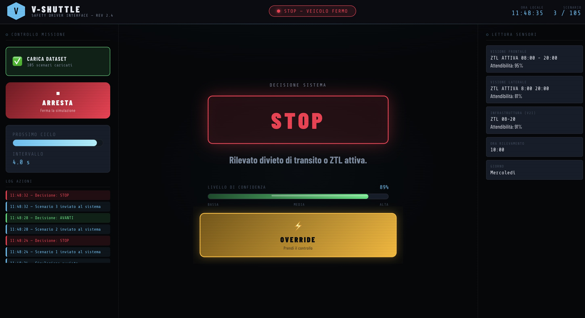
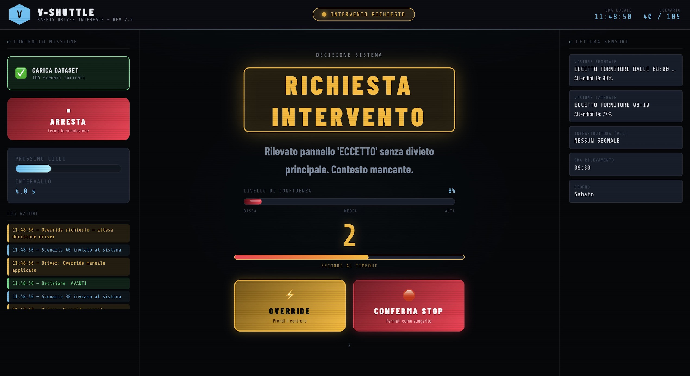
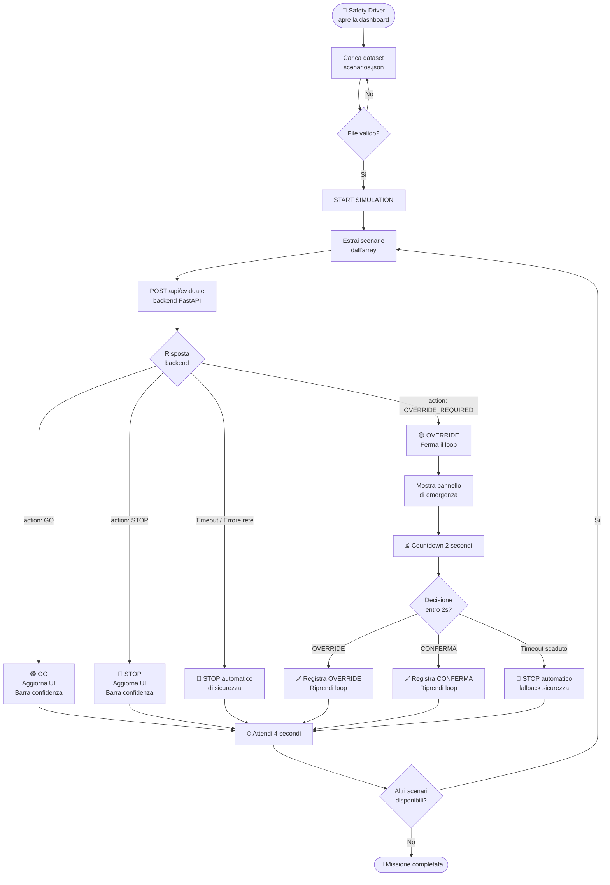

# V-SHUTTLE — Safety Driver Interface

> **Hackathon Hastega × Waymo LCC** — Interfaccia di controllo in tempo reale per il Safety Driver di una navetta a guida autonoma di Livello 4.

---

## Il Problema e l'Approccio

Le navette V-Shuttle di Waymo LCC operano nei centri storici toscani, dove cartelli stradali complessi, ambigui o degradati dall'OCR mettono in crisi il sistema di guida autonoma. Quando l'algoritmo è incerto, blocca il veicolo causando il cosiddetto **"Phantom Braking"** e mostra al Safety Driver (Marco) messaggi di errore incomprensibili, facendogli perdere secondi preziosi.

**La nostra soluzione si articola in due componenti:**

1. **Parser Semantico (backend)** — Riceve i dati grezzi dei 3 sensori, li normalizza (pulizia OCR), li fonde con un algoritmo pesato per affidabilità e applica un Rule Engine deterministico per decidere `GO`, `STOP` o `OVERRIDE_REQUIRED`.
2. **Dashboard Touch Live (frontend)** — Mostra a Marco la decisione in modo immediato e cromaticamente inequivocabile (verde/rosso/giallo), senza gergo tecnico, con un ciclo automatico ogni 4 secondi e un pannello di emergenza con countdown di 2 secondi per l'intervento umano.

---

## Team

| Nome           | Ruolo                                                   |
| -------------- | ------------------------------------------------------- |
| Luca Granucci | Backend — algoritmo di fusione sensoriale e Rule Engine |
| Paolo Walsh | Frontend — Dashboard UI e SimulationController          |
| Marco Franzoni | Architettura, integrazione e QA                         |

---

## Screenshot della Dashboard

**Stato GO — Navetta autorizzata al transito**



**Stato STOP — Divieto attivo rilevato**



**Stato OVERRIDE — Richiesta intervento operatore**



---

## Algoritmo di Fusione dei Sensori

### Sorgenti e Pesi

La navetta dispone di 3 sensori, ciascuno con un campo `confidenza` (0.0–1.0) passato nel JSON:

| Sensore           |           Affidabilità tipica |
| ----------------- | ----------------------------: |
| `camera_frontale` |                Alta (0.8–1.0) |
| `camera_laterale` |               Media (0.5–0.8) |
| `V2I_receiver`    | Variabile / può essere `null` |

I sensori con `testo = null` o `confidenza = null` sono ignorati; non generano errori.

### Formula di Fusione

Per ogni **tag semantico** $T$ (es. `DIVIETO_TRANSITO`, `ECCEZIONE_GENERICA`, `TARGET_BUS`, …), lo score accumulato è la somma pesata dei sensori che lo riconoscono:

$$S(T) = \sum_{i \in \text{sensori attivi}} w_i \cdot \mathbb{1}[\text{sensore}\;i\;\text{rileva}\;T]$$

dove $w_i$ è la `confidenza` del sensore $i$. La **confidenza normalizzata** dell'intero scenario è:

$$\hat{c} = \frac{\sum_{i} w_i}{|\text{sensori attivi}|}$$

Un tag viene poi classificato in base al rapporto $S(T)/\hat{c}$:

| Soglia          | Classificazione                                        |
| --------------- | ------------------------------------------------------ |
| $> 0.4$         | **Confermato** — la maggioranza ponderata lo rileva    |
| $0.1 \;–\; 0.3$ | **Ambiguo** — minoranza significativa ma non dominante |
| $< 0.1$         | **Assente**                                            |

### Gestione dei Casi Limite (Edge Cases)

| Scenario                                   | Tag risultanti                                              | Decisione           | Ragione                                     |
| ------------------------------------------ | ----------------------------------------------------------- | ------------------- | ------------------------------------------- |
| 2 sensori → STOP, 1 → GO                   | `DIVIETO_TRANSITO` confermato                               | **STOP**            | Maggioranza ponderata supera soglia 0.4     |
| 1 sensore → STOP, 2 in conflitto           | tag ambiguo                                                 | **STOP + OVERRIDE** | Conflitto insanabile → Marco decide         |
| Tutti i sensori offline / `null`           | nessun tag                                                  | **STOP + OVERRIDE** | Blackout totale, frenata di sicurezza       |
| ZTL attiva ma orario corrente fuori range  | `DIVIETO_TRANSITO` + `FUORI_RESTRIZIONE`                    | **GO**              | Restrizione non attiva in questo momento    |
| Cartello "Eccetto BUS" in ZTL attiva       | `DIVIETO_TRANSITO` + `ECCEZIONE_GENERICA` + `TARGET_BUS`    | **GO**              | La navetta è classificata come BUS/L4       |
| "Eccetto" senza divieto principale         | `ECCEZIONE_GENERICA` senza `DIVIETO_TRANSITO`               | **STOP + OVERRIDE** | Contesto mancante, Marco decide             |
| Restrizione "solo festivi", giorno feriale | `SOLO_FESTIVI` + giorno ≠ Domenica                          | **GO**              | Regola non applicabile oggi                 |
| Cartello con eccezioni ma non per BUS      | `DIVIETO_TRANSITO` + `ECCEZIONE_GENERICA` (no `TARGET_BUS`) | **STOP**            | Eccezione esiste ma non copre le navette L4 |
| Varco ZTL esplicitamente inattivo          | `VARCO_INATTIVO`                                            | **GO**              | Il varco è spento, nessuna restrizione      |

### Normalizzazione OCR

Prima della fusione, ogni testo grezzo viene pulito da `SensorFusionEngine._clean_text()`:

- **Lettere separate** — `"D I V I E T O"` → `"DIVIETO"` (lettere singole adiacenti unite)
- **Leet-speak** — `"D1V1ET0"` → `"DIVIETO"`, `"ACCE550"` → `"ACCESSO"`, `"V4RC0"` → `"VARCO"`, ecc.
- **Orari OCR-corrotti** — `"O6:OO"` → `"06:00"` (fix applicato solo a token con formato `HH:MM`)
- **Formati H24** — `"0-24"`, `"H24"`, `"SEMPRE"` normalizzati a `00:00`–`23:59`

---

## Schema Architetturale



---

## Stack Tecnologico

| Layer        | Tecnologie                                      |
| ------------ | ----------------------------------------------- |
| **Frontend** | Vite · HTML5 · CSS3 · Vanilla JavaScript (ES6+) |
| **Backend**  | Python · FastAPI · Uvicorn · Pydantic           |

---

## Installazione e Avvio

### Prerequisiti

- **Node.js ≥ 18**
- **Python ≥ 3.10**

> Avviare prima il backend e poi il frontend.

---

### 1 — Backend

```bash
cd backend

# Crea e attiva il virtual environment (consigliato)
python -m venv .venv
source .venv/bin/activate        # macOS / Linux
.venv\Scripts\activate           # Windows

# Installa le dipendenze
pip install -r requirements.txt

# Avvia il server  →  http://localhost:8000
uvicorn main:app --reload
```

---

### 2 — Frontend

```bash
cd frontend

# Installa le dipendenze
npm install

# Avvia il dev server  →  http://localhost:5173
npm run dev
```

Aprire il browser su **http://localhost:5173**, caricare un file `.json` di scenari e premere **START SIMULATION**.

---

## Struttura del Progetto

```
v-shuttle/
├── backend/
│   ├── main.py             # FastAPI app — fusione, Rule Engine, endpoint
│   └── requirements.txt
├── data/
│   ├── VShuttle-input.json          # dataset di esempio
│   └── VShuttle-input-complete.json # dataset completo
├── frontend/
│   ├── index.html
│   ├── style.css
│   └── main.js             # SimulationController + UIRenderer
├── diagram.mermaid          # schema architetturale sorgente
└── README.md
```

---

## Note Operative

- Il backend gira su `localhost:8000`, il frontend su `localhost:5173`. Il CORS è già configurato.
- Se il backend non risponde entro il timeout dell'endpoint, il frontend applica automaticamente **STOP** senza mostrare messaggi tecnici a schermo.
- Il repository non include `node_modules/`, `.venv/` o file di build.
